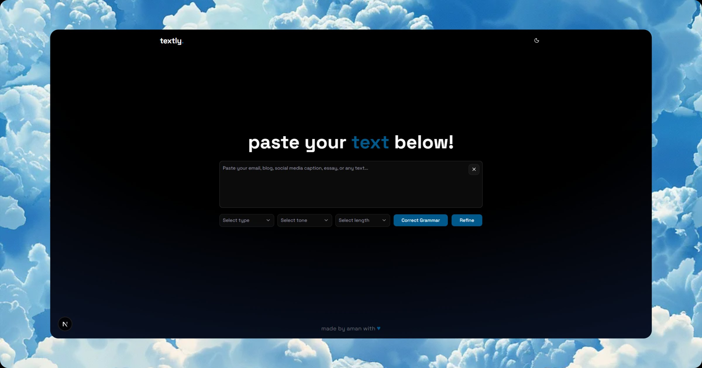

# Textly ✍️

Textly is a free AI-powered writing assistant designed to help users refine their text, improve grammar, and enhance various forms of written communication. Built with Next.js, it leverages AI models to provide quick and effective text transformations for emails, blog posts, social media, essays, and more.

[](https://nextjs.org/)
[](https://reactjs.org/)
[](https://www.typescriptlang.org/)
[](https://tailwindcss.com/)
[](https://groq.com/)



## ✨ Features

- **AI Text Refinement** 🤖: Enhance clarity, readability, and sentence flow for any text.
- **Grammar & Spelling Correction** ✏️: Automatically fix grammatical errors, typos, and punctuation mistakes.
- **Tone Adjustment** 🗣️: Adapt your writing to various tones like professional, friendly, casual, and more.
- **Length Control** 📏: Shorten text for conciseness or expand it for more detail.
- **Content Type Adaptation** 📄: Tailor your writing for specific formats such as emails, blog posts, social media, and essays.
- **Real-time Feedback** ⚡: Experience fast and responsive text processing.
- **Dark Mode Support** 🌙: A comfortable reading experience in any lighting condition.
- **User-Friendly Interface** 👍: An intuitive design for seamless text input and output.

## 🚀 Getting Started

### Prerequisites

- Node.js (version 18 or higher recommended)
- npm, yarn, or pnpm

### Installation

1. **Clone the repository:**
   ```bash
   git clone https://github.com/amannv/Textly.git
   cd Textly
   ```

2. **Install dependencies:**
   ```bash
   npm install
   # or
   yarn install
   # or
   pnpm install
   ```

3. **Set up environment variables:**
   Create a `.env` file in the root of the project and add your API key for the AI model:
   ```env
   GROQ_API_KEY=your_groq_api_key_here
   NEXT_PUBLIC_APP_URL=http://localhost:3000
   ```

### Running the Development Server

Start the application in development mode:

```bash
npm run dev
# or
yarn dev
# or
pnpm dev
```

Open [http://localhost:3000](http://localhost:3000) in your browser to see the application running.

## 💡 Usage

Textly provides a straightforward interface to refine and correct your text:

1. **Input Text:** Paste your text into the main text area. The application supports up to 5000 characters.
2. **Select Options (Optional):**
   - **Type:** Choose the type of content (e.g., Email, Blog Post, Social Media Post).
   - **Tone:** Select a desired tone (e.g., Professional, Friendly, Concise).
   - **Length:** Adjust the desired length (Shorter, Same, Longer).
3. **Process Text:**
   - Click **"Correct Grammar"** to fix grammar, spelling, and punctuation.
   - Click **"Refine"** to improve the overall writing quality based on selected options.
4. **View and Copy Result:** The refined or corrected text will appear below. You can copy the result using the copy icon.
5. **Clear:** Use the 'X' button to clear the input and reset all options.

### Example Scenario

**Input Text:**
```
i am going to the store too buy some fruit. i hope they have apples.
```

**Action:** Click **"Correct Grammar"**.

**Output:**
```
I am going to the store to buy some fruit. I hope they have apples.
```

**Input Text:**
```
Our new product is really cool and useful for everyone. It will make your life much easier. Buy it now!
```

**Action:** Select **Tone: "Professional"**, **Type: "Email"**, then click **"Refine"**.

**Output:**
```
We are excited to introduce our new product, designed to offer significant value and utility. Its innovative features are tailored to enhance your daily life by providing practical solutions and simplifying tasks. We encourage you to explore its benefits.
```

## 📚 Project Structure

The project follows a standard Next.js directory structure:

```
textly/
├── app/
│   ├── api/
│   │   └── refine/route.ts  # API route for text processing
│   ├── services/             # AI service logic
│   ├── utils/                # Utility functions (prompt, rate limiting, etc.)
│   ├── globals.css           # Global styles
│   └── layout.tsx            # Root layout component
├── components/
│   ├── ui/                   # Reusable UI components (shadcn/ui)
│   ├── Dashboard.tsx         # Main application dashboard component
│   ├── LengthSelector.tsx    # Component for length selection
│   ├── Navbar.tsx            # Navigation bar component
│   ├── ThemeProvider.tsx     # Theme provider for dark mode
│   ├── ThemeToggle.tsx       # Component to toggle theme
│   ├── ToneSelector.tsx      # Component for tone selection
│   └── TypeSelector.tsx      # Component for content type selection
├── lib/
│   ├── githubIcon.tsx        # GitHub icon component
│   └── utils.ts              # Utility functions (cn for class merging)
├── public/
│   └── ...
├── .env                      # Environment variables (GROQ_API_KEY, NEXT_PUBLIC_APP_URL)
├── next.config.ts            # Next.js configuration
├── package.json              # Project dependencies and scripts
├── tsconfig.json             # TypeScript configuration
└── README.md                 # Project README file
```

## 🛠️ Tech Stack

- **Framework:** Next.js (v16)
- **Language:** TypeScript
- **UI Components:** shadcn/ui (built with @base-ui/react)
- **Styling:** Tailwind CSS (v4)
- **AI Integration:** Groq SDK (`groq-sdk`) (Llama 3.3 model)
- **State Management:** React Hooks (useState, useRef, useEffect)
- **API Communication:** Axios
- **Utilities:** clsx, tailwind-merge
- **Animations:** tw-animate-css
- **Fonts:** Space Grotesk (via next/font/google)
- **Hosting/Deployment:** Vercel (analytics)

## 🔗 Important Links

- **Live Demo:** [https://textly-aman.vercel.app/](https://textly-aman.vercel.app/)
- **Repository:** [https://github.com/amannv/Textly](https://github.com/amannv/Textly)

## 🤝 Contributing

Contributions are welcome! Please feel free to:

- Fork the repository.
- Create a new branch (`git checkout -b feature/your-feature-name`).
- Make your changes.
- Commit your changes (`git commit -m 'Add some feature'`).
- Push to the branch (`git push origin feature/your-feature-name`).
- Open a Pull Request.

For bug reports or feature requests, please open an issue on GitHub.

## Footer

<p align="center">
  Made with ❤️ by <a href="https://github.com/amannv">Aman Verma</a>
</p>
<p align="center">
  <a href="https://github.com/amannv/Textly/stargazers"></a>
  <a href="https://github.com/amannv/Textly/forks"></a>
</p>
<p align="center">
  <a href="https://github.com/amannv/Textly/issues">Report an issue</a>
</p>